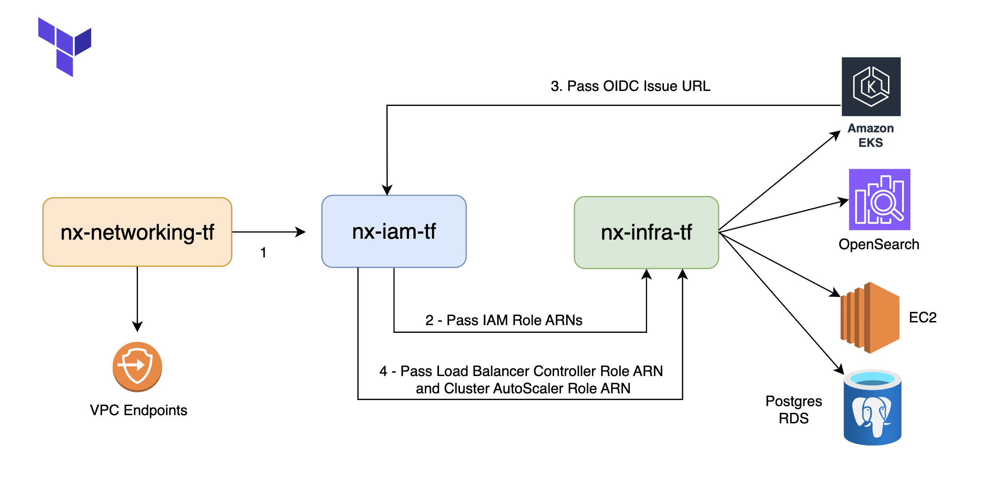

# Nx Infra Module

Terraform module to provision the complete AWS infrastructure stack for the NX application. This includes:

- Amazon EKS cluster
- Amazon RDS (PostgreSQL)
- Amazon OpenSearch
- EC2 instance for NFS
- EC2 instance for Bastion

---

## 📌 Requirements

| Name      | Version   |
|-----------|-----------|
| Terraform | >= 1.0    |
| AWS CLI   | >= 2.0    |

---

## 📦 Providers

| Name     | Source              |
|----------|---------------------|
| aws      | hashicorp/aws       |
| helm     | hashicorp/helm      | 

---

## Usage Notes

To avoid dependency errors during the creation of the OIDC provider for IRSA, apply this module in two stages:



### Step 1 – Initial Apply (IAM First)

First, apply the `nx-iam-tf` module to create IAM roles and related resources.  
Then, pass its outputs as inputs to the `nx-infra-tf` module and run:

```
terraform apply --target="module.nx"
```
Once the infrastructure is created, extract the oidc_issuer_url from the outputs of nx-infra-tf.

### Step 2 – Final Apply.

Update the nx-iam-tf module configuration with the oidc_issuer_url and re-apply it with enable_irsa = true.
After the apply, extract the oidc_provider_arn from its outputs.

Then set the correct OIDC Provider ARN in nx-infra-tf:

```
oidc_provider_arn     = ""
```
```
terraform apply
```

## Modules

| Name | Source | Version |
|------|--------|---------|
| <a name="module_eks"></a> [eks](#module\_eks) | terraform-aws-modules/eks/aws | 20.37.0 |
| <a name="module_opensearch"></a> [opensearch](#module\_opensearch) | terraform-aws-modules/opensearch/aws | 1.7.0 |
| <a name="module_postgresql"></a> [postgresql](#module\_postgresql) | terraform-aws-modules/rds/aws | 6.12.0 |

## Resources

| Name | Type |
|------|------|
| [aws_db_subnet_group.private](https://registry.terraform.io/providers/hashicorp/aws/latest/docs/resources/db_subnet_group) | resource |
| [aws_instance.bastion_ec2](https://registry.terraform.io/providers/hashicorp/aws/latest/docs/resources/instance) | resource |
| [aws_instance.nfs_ec2](https://registry.terraform.io/providers/hashicorp/aws/latest/docs/resources/instance) | resource |
| [aws_key_pair.bastion_ec2_key](https://registry.terraform.io/providers/hashicorp/aws/latest/docs/resources/key_pair) | resource |
| [aws_key_pair.ec2_key](https://registry.terraform.io/providers/hashicorp/aws/latest/docs/resources/key_pair) | resource |
| [aws_security_group.bastion_ec2_sg](https://registry.terraform.io/providers/hashicorp/aws/latest/docs/resources/security_group) | resource |
| [aws_security_group.db_sg](https://registry.terraform.io/providers/hashicorp/aws/latest/docs/resources/security_group) | resource |
| [aws_security_group.ec2_sg](https://registry.terraform.io/providers/hashicorp/aws/latest/docs/resources/security_group) | resource |
| [aws_security_group.opensearch_sg](https://registry.terraform.io/providers/hashicorp/aws/latest/docs/resources/security_group) | resource |
| [aws_security_group_rule.eks_control_plane_ingress](https://registry.terraform.io/providers/hashicorp/aws/latest/docs/resources/security_group_rule) | resource |
| [tls_private_key.bastion_ec2_key](https://registry.terraform.io/providers/hashicorp/tls/latest/docs/resources/private_key) | resource |
| [tls_private_key.ec2_key](https://registry.terraform.io/providers/hashicorp/tls/latest/docs/resources/private_key) | resource |

## Inputs

| Name | Description | Type | Default | Required |
|------|-------------|------|---------|:--------:|
| <a name="input_allocated_storage"></a> [allocated\_storage](#input\_allocated\_storage) | The size of the database storage in GB | `string` | n/a | yes |
| <a name="input_allow_major_version_upgrade"></a> [allow\_major\_version\_upgrade](#input\_allow\_major\_version\_upgrade) | Whether to allow major version upgrades during updates | `bool` | `false` | no |
| <a name="input_ami"></a> [ami](#input\_ami) | The AMI ID for the EC2 instance | `string` | n/a | yes |
| <a name="input_apply_immediately"></a> [apply\_immediately](#input\_apply\_immediately) | Whether to apply changes immediately or during the next maintenance window | `bool` | `false` | no |
| <a name="input_auto_software_update_enabled"></a> [auto\_software\_update\_enabled](#input\_auto\_software\_update\_enabled) | Whether automatic software updates are enabled | `bool` | `false` | no |
| <a name="input_availability_zone_count"></a> [availability\_zone\_count](#input\_availability\_zone\_count) | Number of Availability Zones to use if zone awareness is enabled | `number` | `1` | no |
| <a name="input_backup_retention_period"></a> [backup\_retention\_period](#input\_backup\_retention\_period) | The number of days to retain backups for | `number` | `7` | no |
| <a name="input_backup_window"></a> [backup\_window](#input\_backup\_window) | Preferred backup window | `string` | `"03:00-06:00"` | no |
| <a name="input_bastion_ami"></a> [bastion\_ami](#input\_bastion\_ami) | The AMI ID for the EC2 instance | `string` | n/a | yes |
| <a name="input_bastion_disk_size"></a> [bastion\_disk\_size](#input\_bastion\_disk\_size) | Size of the root volume in GB | `number` | `8` | no |
| <a name="input_bastion_ec2_name"></a> [bastion\_ec2\_name](#input\_bastion\_ec2\_name) | The Name tag for the EC2 instance | `string` | `"nx-bastion-host"` | no |
| <a name="input_bastion_existing_pem"></a> [bastion\_existing\_pem](#input\_bastion\_existing\_pem) | Existing PEM key to use, if provided | `string` | `""` | no |
| <a name="input_bastion_ingress_rules"></a> [bastion\_ingress\_rules](#input\_bastion\_ingress\_rules) | List of ingress rules for Bastion EC2 security group | <pre>list(object({<br/>    description = string<br/>    from_port   = number<br/>    to_port     = number<br/>    protocol    = string<br/>    cidr_blocks = list(string)<br/>  }))</pre> | `[]` | no |
| <a name="input_bastion_instance_type"></a> [bastion\_instance\_type](#input\_bastion\_instance\_type) | Instance type for the EC2 instance | `string` | `"t3.small"` | no |
| <a name="input_bastion_key_name"></a> [bastion\_key\_name](#input\_bastion\_key\_name) | Name of the key pair to use for the Bastion EC2 instance | `string` | `""` | no |
| <a name="input_bastion_public_subnet_id"></a> [bastion\_public\_subnet\_id](#input\_bastion\_public\_subnet\_id) | Private subnet ID where the Bastion EC2 instance will be deployed | `string` | `""` | no |
| <a name="input_bastion_security_group_description"></a> [bastion\_security\_group\_description](#input\_bastion\_security\_group\_description) | Description for the Bastion EC2 security group | `string` | `"Allow SSH access"` | no |
| <a name="input_bastion_security_group_name"></a> [bastion\_security\_group\_name](#input\_bastion\_security\_group\_name) | The name of the security group for the EC2 instance | `string` | n/a | yes |
| <a name="input_cluster_endpoint_private_access"></a> [cluster\_endpoint\_private\_access](#input\_cluster\_endpoint\_private\_access) | Enable private access to EKS cluster endpoint | `bool` | `true` | no |
| <a name="input_cluster_endpoint_public_access"></a> [cluster\_endpoint\_public\_access](#input\_cluster\_endpoint\_public\_access) | Enable public access to EKS cluster endpoint | `bool` | `true` | no |
| <a name="input_cluster_endpoint_public_access_cidrs"></a> [cluster\_endpoint\_public\_access\_cidrs](#input\_cluster\_endpoint\_public\_access\_cidrs) | List of CIDR blocks which can access the Amazon EKS public API server endpoint | `list(string)` | <pre>[<br/>  "0.0.0.0/0"<br/>]</pre> | no |
| <a name="input_cluster_iam_role_arn"></a> [cluster\_iam\_role\_arn](#input\_cluster\_iam\_role\_arn) | Cluster IAM role ARN | `string` | n/a | yes |
| <a name="input_cluster_name"></a> [cluster\_name](#input\_cluster\_name) | EKS Cluster Name | `string` | n/a | yes |
| <a name="input_cluster_version"></a> [cluster\_version](#input\_cluster\_version) | Kubernetes version for the EKS cluster | `string` | n/a | yes |
| <a name="input_copy_tags_to_snapshot"></a> [copy\_tags\_to\_snapshot](#input\_copy\_tags\_to\_snapshot) | Whether to copy tags to snapshots | `bool` | `true` | no |
| <a name="input_create_iam_role"></a> [create\_iam\_role](#input\_create\_iam\_role) | Whether to create a new IAM role for the EKS cluster. Set to false if IAM is managed externally. | `bool` | `false` | no |
| <a name="input_db_identifier"></a> [db\_identifier](#input\_db\_identifier) | The identifier for the RDS instance | `string` | n/a | yes |
| <a name="input_db_name"></a> [db\_name](#input\_db\_name) | The name of the database | `string` | n/a | yes |
| <a name="input_db_security_group_description"></a> [db\_security\_group\_description](#input\_db\_security\_group\_description) | Description for the RDS security group | `string` | `"Managed by Terraform"` | no |
| <a name="input_db_security_group_name"></a> [db\_security\_group\_name](#input\_db\_security\_group\_name) | The name of the database security group | `string` | n/a | yes |
| <a name="input_db_subnet_group_name"></a> [db\_subnet\_group\_name](#input\_db\_subnet\_group\_name) | The name of the database subnet group | `string` | n/a | yes |
| <a name="input_disk_size"></a> [disk\_size](#input\_disk\_size) | Size of the root volume in GB | `number` | `100` | no |
| <a name="input_domain_name"></a> [domain\_name](#input\_domain\_name) | The domain name for the OpenSearch cluster | `string` | n/a | yes |
| <a name="input_ebs_volume_size"></a> [ebs\_volume\_size](#input\_ebs\_volume\_size) | The size of the EBS volume in GB for OpenSearch | `string` | n/a | yes |
| <a name="input_ebs_volume_type"></a> [ebs\_volume\_type](#input\_ebs\_volume\_type) | EBS volume type for OpenSearch nodes | `string` | `"gp3"` | no |
| <a name="input_ec2_name"></a> [ec2\_name](#input\_ec2\_name) | The Name tag for the EC2 instance | `string` | n/a | yes |
| <a name="input_eks_managed_node_groups"></a> [eks\_managed\_node\_groups](#input\_eks\_managed\_node\_groups) | Map of EKS managed node group definitions to create | `any` | `{}` | no |
| <a name="input_enable_bastion"></a> [enable\_bastion](#input\_enable\_bastion) | Flag to control Bastion resource creation | `bool` | `false` | no |
| <a name="input_enable_irsa"></a> [enable\_irsa](#input\_enable\_irsa) | Enable IRSA (IAM Roles for Service Accounts). OIDC provider will be created by IAM module. | `bool` | `false` | no |
| <a name="input_enable_masternodes"></a> [enable\_masternodes](#input\_enable\_masternodes) | Enable master nodes for OpenSearch | `bool` | n/a | yes |
| <a name="input_enable_nfs"></a> [enable\_nfs](#input\_enable\_nfs) | Flag to control EC2-related resource creation | `bool` | n/a | yes |
| <a name="input_enable_opensearch"></a> [enable\_opensearch](#input\_enable\_opensearch) | Flag to enable or disable OpenSearch and related resources | `bool` | n/a | yes |
| <a name="input_enable_postgres"></a> [enable\_postgres](#input\_enable\_postgres) | Flag to enable/disable PostgreSQL and related resources | `bool` | n/a | yes |
| <a name="input_engine_version"></a> [engine\_version](#input\_engine\_version) | The version of the OpenSearch engine | `string` | n/a | yes |
| <a name="input_existing_pem"></a> [existing\_pem](#input\_existing\_pem) | Existing PEM key to use, if provided | `string` | `""` | no |
| <a name="input_instance_class"></a> [instance\_class](#input\_instance\_class) | The class of the RDS instance | `string` | n/a | yes |
| <a name="input_instance_type"></a> [instance\_type](#input\_instance\_type) | Instance type for the EC2 instance | `string` | n/a | yes |
| <a name="input_key_name"></a> [key\_name](#input\_key\_name) | Name of the key pair to use for the EC2 instance | `string` | n/a | yes |
| <a name="input_maintenance_window"></a> [maintenance\_window](#input\_maintenance\_window) | Preferred maintenance window | `string` | `"mon:00:00-mon:03:00"` | no |
| <a name="input_manage_master_user_password"></a> [manage\_master\_user\_password](#input\_manage\_master\_user\_password) | Whether the master user password is managed by RDS automatically | `bool` | `false` | no |
| <a name="input_master_user_name"></a> [master\_user\_name](#input\_master\_user\_name) | The username for the OpenSearch admin | `string` | n/a | yes |
| <a name="input_nfs_ingress_rules"></a> [nfs\_ingress\_rules](#input\_nfs\_ingress\_rules) | List of ingress rules for NFS EC2 security group | <pre>list(object({<br/>    description = string<br/>    from_port   = number<br/>    to_port     = number<br/>    protocol    = string<br/>    cidr_blocks = list(string)<br/>  }))</pre> | `[]` | no |
| <a name="input_nfs_private_subnet_id"></a> [nfs\_private\_subnet\_id](#input\_nfs\_private\_subnet\_id) | Private subnet ID where the EC2 instance will be deployed | `string` | n/a | yes |
| <a name="input_nfs_security_group_description"></a> [nfs\_security\_group\_description](#input\_nfs\_security\_group\_description) | Description for the NFS EC2 security group | `string` | `"Allow SSH and NFS access"` | no |
| <a name="input_number_of_master_nodes"></a> [number\_of\_master\_nodes](#input\_number\_of\_master\_nodes) | Number of master nodes for OpenSearch | `number` | n/a | yes |
| <a name="input_number_of_nodes"></a> [number\_of\_nodes](#input\_number\_of\_nodes) | Number of data nodes for OpenSearch | `number` | n/a | yes |
| <a name="input_opensearch_ingress_rules"></a> [opensearch\_ingress\_rules](#input\_opensearch\_ingress\_rules) | List of ingress rules | <pre>list(object({<br/>    from_port   = number<br/>    to_port     = number<br/>    protocol    = string<br/>    cidr_blocks = list(string)<br/>  }))</pre> | `[]` | no |
| <a name="input_opensearch_instance_type"></a> [opensearch\_instance\_type](#input\_opensearch\_instance\_type) | The type of instance for the OpenSearch cluster | `string` | n/a | yes |
| <a name="input_opensearch_log_publishing_options"></a> [opensearch\_log\_publishing\_options](#input\_opensearch\_log\_publishing\_options) | List of log publishing options for OpenSearch | <pre>list(object({<br/>    log_type = string<br/>  }))</pre> | `[]` | no |
| <a name="input_opensearch_master_user_password"></a> [opensearch\_master\_user\_password](#input\_opensearch\_master\_user\_password) | The password for the OpenSearch admin | `string` | `null` | no |
| <a name="input_opensearch_security_group_description"></a> [opensearch\_security\_group\_description](#input\_opensearch\_security\_group\_description) | Description for the OpenSearch security group | `string` | `"Managed by Terraform"` | no |
| <a name="input_opensearch_security_group_name"></a> [opensearch\_security\_group\_name](#input\_opensearch\_security\_group\_name) | The name of the security group for OpenSearch | `string` | n/a | yes |
| <a name="input_opensearch_subnet_ids"></a> [opensearch\_subnet\_ids](#input\_opensearch\_subnet\_ids) | List of private subnet IDs for OpenSearch | `list(string)` | n/a | yes |
| <a name="input_parameter_group_name"></a> [parameter\_group\_name](#input\_parameter\_group\_name) | Name of the DB parameter group to associate | `string` | `null` | no |
| <a name="input_performance_insights_enabled"></a> [performance\_insights\_enabled](#input\_performance\_insights\_enabled) | Specifies whether Performance Insights are enabled | `bool` | `false` | no |
| <a name="input_postgres_ingress_rules"></a> [postgres\_ingress\_rules](#input\_postgres\_ingress\_rules) | List of ingress rules | <pre>list(object({<br/>    from_port   = number<br/>    to_port     = number<br/>    protocol    = string<br/>    cidr_blocks = list(string)<br/>  }))</pre> | `[]` | no |
| <a name="input_postgres_password"></a> [postgres\_password](#input\_postgres\_password) | The password for the database | `string` | `null` | no |
| <a name="input_postgres_version"></a> [postgres\_version](#input\_postgres\_version) | PostgreSQL version for the RDS instance | `string` | n/a | yes |
| <a name="input_private_subnets"></a> [private\_subnets](#input\_private\_subnets) | List of private subnets in the VPC | `list(string)` | n/a | yes |
| <a name="input_region"></a> [region](#input\_region) | The AWS region to deploy resources into | `string` | n/a | yes |
| <a name="input_security_group_name"></a> [security\_group\_name](#input\_security\_group\_name) | The name of the security group for the EC2 instance | `string` | n/a | yes |
| <a name="input_skip_final_snapshot"></a> [skip\_final\_snapshot](#input\_skip\_final\_snapshot) | Whether to skip the final snapshot before deleting the instance | `bool` | `false` | no |
| <a name="input_subnet_group_description"></a> [subnet\_group\_description](#input\_subnet\_group\_description) | Description for the RDS subnet group | `string` | `"Managed by Terraform"` | no |
| <a name="input_tags"></a> [tags](#input\_tags) | A map of tags to assign to all applicable resources | `map(string)` | <pre>{<br/>  "Project": "nx-app"<br/>}</pre> | no |
| <a name="input_username"></a> [username](#input\_username) | The username for the database | `string` | n/a | yes |
| <a name="input_vpc_cidr_block"></a> [vpc\_cidr\_block](#input\_vpc\_cidr\_block) | CIDR block of the VPC | `string` | n/a | yes |
| <a name="input_vpc_id"></a> [vpc\_id](#input\_vpc\_id) | The ID of the VPC | `string` | n/a | yes |
| <a name="input_zone_awareness_enabled"></a> [zone\_awareness\_enabled](#input\_zone\_awareness\_enabled) | Whether to enable zone awareness for OpenSearch cluster | `bool` | `false` | no |

## Outputs

| Name | Description |
|------|-------------|
| <a name="output_bastion_private_key_pem"></a> [bastion\_private\_key\_pem](#output\_bastion\_private\_key\_pem) | The private key in PEM format (only generated if enable\_bastion is true and no existing PEM is provided) |
| <a name="output_eks_cluster_ca"></a> [eks\_cluster\_ca](#output\_eks\_cluster\_ca) | The base64-encoded CA certificate for the EKS cluster |
| <a name="output_eks_cluster_endpoint"></a> [eks\_cluster\_endpoint](#output\_eks\_cluster\_endpoint) | The endpoint for the EKS control plane |
| <a name="output_eks_cluster_name"></a> [eks\_cluster\_name](#output\_eks\_cluster\_name) | The name of the EKS cluster |
| <a name="output_eks_oidc_provider_arn"></a> [eks\_oidc\_provider\_arn](#output\_eks\_oidc\_provider\_arn) | The OIDC provider ARN for the EKS cluster |
| <a name="output_oidc_provider_url"></a> [oidc\_provider\_url](#output\_oidc\_provider\_url) | The OpenID Connect identity provider (issuer URL) |
| <a name="output_private_key_pem"></a> [private\_key\_pem](#output\_private\_key\_pem) | The private key in PEM format (only generated if enable\_nfs is true and no existing PEM is provided) |
